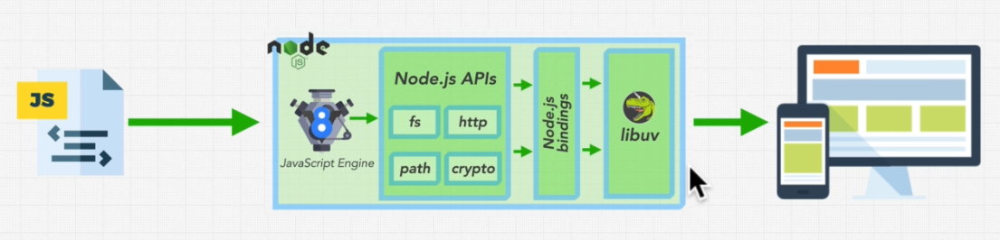

# Node 

Node.js is an open-source, cross-platform, back-end JavaScript runtime environment that runs on the V8 engine and executes JavaScript code outside a web browser

## Node js Internal Flow
Node js contains four main parts

1. V8 JavaScript Engine  - which allows us to run js code
2. Node.js APIs    - this API will call the c++ node js bindings
3. Node.js Bindings -- this lets your js code to call functionality that implemented in c and c++
4. libuv  -- come core functionality, working file or the HTTP live in libuv . 

*** libuv is a multi-platform C library that provides support for asynchronous I/O based on event loops ***

A Node.js app runs in a single process. While this certainly has its pros and cons, the asynchronous nature of Node.js allows it to handle multiple requests to a server without the hassle of managing threads.

## The Event Loop

## Js vs Node
| Js        | Node       |
|-----------|------------|
| window    | global     |
| document  | process    |
| history   | module     |
| location  | __filename |
| navigator | require()  |